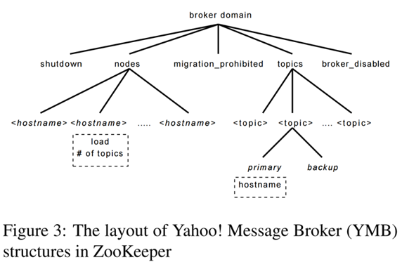
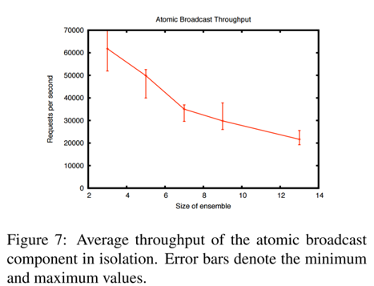
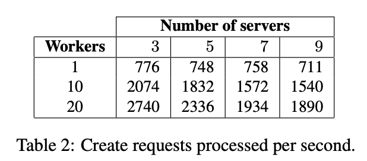
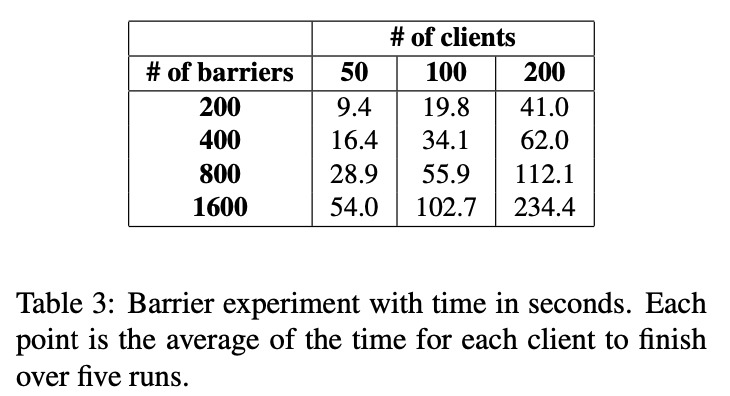

# ZooKeeper: wait-free 的大型网络协调系统

## Abstract

在这篇论文中，我们描述了 ZooKeeper，一个协调分布式应用的服务。ZooKeeper 是基础架构的一部分，目标是提供一个简单的、高性能的内核，供客户端构建更复杂的协调原语。它在多副本、中心化的服务中，组合了 group messaging, shared registers 和分布式锁服务。ZooKeeper 提供的接口有 wait-free 的 shared registers, 和一个与文件系统 cache 失效相似的事件驱动机制，用于提供一个简单但功能强大的协调服务。

ZooKeeper 接口使实现高性能服务成为可能。除了 wait-free 的属性之外，ZooKeeper 提供了一个**每个客户端请求是 FIFO 执行**的语义，和**改变 ZooKeeper 状态的请求都是 Linearizable** 的语义。这些设计决策可以使 ZooKeeper 的读可以读本地服务器，使实现高性能处理请求流水线成为可能。对于目标工作负载，我们显示了2:1到100:1 的读/写请求比例，ZooKeeper 每秒可以处理成千上万的事务。 这种性能使 ZooKeeper 可以被客户端应用程序广泛使用。

## 1. Introduction

大规模的分布式应用需要不同形式的协调。配置是最基础的形式之一。在配置最简单的形式，系统进程中，配置是一个系统进程的的可操作的参数列表，更复杂的系统有动态的配置参数。Group membership 和领导选举也是分布式系统的共有服务：通常，进程需要知道哪些别的进程状态是 alive 的和这些进程负责什么。Locks 建立了一个强大的同步原语，实现对关键资源的互斥访问。

一种协调的方式是，为不同的需求开发不同的服务。例如，Amazon Simple Queue Service \[3\] 专注于队列服务。其他服务也因为需要用于特定的用处而开发，比如领导选举和配置。实现了更强原语的服务可以被用于实现没有那么强大原语的服务。例如，Chubby 是一个有很强同步保证的锁服务。锁可以用来实现领导选举，组成员等服务。

当设计我们的协调服务的时候，我们抛弃了在服务端侧实现特定的原语，作为替代，我们选择暴露一个能够使应用开发者实现他们自己同步原语的 API。这样的决定让我们实现一个不需要改变 ZooKeeper 即可实现不同服务的*协调内核*。这种方法允许用户实现多种形式的协调，以适应应用程序的需求，而不是将开发人员限制在一组固定的原语上。

当设计 ZooKeeper 的 API 的时候，我们抛弃了阻塞原语，例如 Locks。阻塞原语对于一个协调服务会引起其它问题，速度较慢或者故障的客户端会对速度较快的客户端产生负面的影响。如果处理请求取决于客户端的响应和其他客户端的失败检测，则服务本身的实现将变得更加复杂。因此，我们的系统 ZooKeeper 实现了一个API，该 API 可以按文件系统的层次结构来组织简单的 wait-free 数据对象。 实际上，ZooKeeper API类似于任何其他文件系统，并且仅从 API 签名来看，ZooKeeper 很像没有锁定（`lock`）方法，打开（`open`）和关闭（`close`）方法的 Chubby。 但是，实现 wait-free 数据对象使 ZooKeeper 与基于锁之类的阻塞原语的系统明显不同。

尽管 wait-free 对于性能和容错性很重要，但不足以进行协调。我们还必须提供操作的顺序保证。特殊的，我们发现，对客户端所有操作提供 FIFO 语义与提供 *linearizable writes* 可以高效的实现服务，并且足以实现应用程序感兴趣的协调原语。实际上，对于任意数量使用 API 的进程，都可以实现一致性，根据Herlihy给出的层次结构，ZooKeeper 实现了全局的对象。

ZooKeeper 使用副本，来保证服务的高可用和性能。它的高性能使包含大量进程的应用程序可以使用这种协调内核来管理协调的各个方面。我们能够使用一个简单的流水线架构，让我们能够处理成百上千的请求，同时仍然保持低延迟。这样的流水线很自然地可以保证对于单个客户端所有操作执行的顺序性。客户端的 FIFO 顺序使得客户端可以异步提交操作请求。使用异步操作，客户端一次可以执行多个未完成的操作。这个功能是很实用的，例如，当新客户端成为领导者并且必须操纵元数据并相应地对其进行更新时。如果不可能进行多个未完成的操作，则初始化时间可以是几秒左右，而不是亚秒级。

为了保证更新操作满足 linearizability，我们实现了一个基于 leader 的原子广播协议 Zab。同时，一个典型的 ZooKeeper 应用中，在支配地位的负载是读操作，所以需要保证读吞吐量的扩展性。在ZooKeeper中，服务器在本地处理读操作，并不需要使用 Zab 来广播。

在客户端侧缓存数据是提升读性能的重要技术。例如，对于一个进程，缓存现有 Leader 的 id，而不是每次需要 leader 时都探测 leader 是很有效的。ZooKeeper 并不直接操作缓存，而是使用一种 watch 机制。有了 watch 机制，一个客户端可以 watch 一个给定对象的更新请求，并接收到更新该对象的请求。（作为对比）Chubby 直接管理客户端的 cache，它会阻塞更新，以使更新部分的客户端的缓存全部失效。在这样的设计下，如果任何客户端响应慢或者出现错误，更新会变得很慢。Chubby 使用 lease 机制防止一个慢或者宕机的客户端阻塞系统。但 leases 只能约束慢客户端或者宕机客户端的影响，ZooKeeper 的 watches 可以完全避免这个问题。

本论文讨论ZooKeeper的设计和实现，使用ZooKeeper，即使只有写入是可线性化的，我们也可以实现应用程序所需的所有协调原语。 为了验证我们的方法，我们展示了如何使用 ZooKeeper 实现一些协调原语。

作为总结，这篇文章中，我们主要的贡献是：

* **Coordination kernel**: 为了在分布式系统中使用，我们添了一个提供 relaxed 的一致性保证的 wait-free 的协作服务。特别是，我们描述了*协调内核*的设计和实现，我们已经在许多关键应用程序中使用了协调内核来实现各种协调技术。
* **Coordination recipes**: 我们展示了 ZooKeeper 如何可用于构建通常在分布式应用程序中使用的高级协调原语，甚至包含阻塞和强一致性原语。
* **Experience with Coordination**: 我们分享了一些使用 ZooKeeper 并评估其性能的方式。

## 2. The ZooKeeper Service

客户端通过 ZooKeeper 客户端 API 库向 ZooKeeper 递交请求。除了暴露 ZooKeeper 服务的 client API 接口, ZooKeeper 客户端库也管理 client 和 ZooKeeper 服务器间的网络连接。

在这一节中，我们写提供一个 ZooKeeper 服务的 high-level view。然后我们讨论 client 与 ZooKeeper 操作的 API。

> **术语** 在这篇论文章，我们使用 *`client`* 来表示一个 ZooKeeper 服务的使用者，*`znode`* 表示一个内存中的 ZooKeeper 数据的节点。`znode` 会被组织成一颗被称为 `data tree` 的带层次的名称空间。我们还使用术语“更新和写入”来指代任何修改数据树状态的操作。 客户端在连接到 ZooKeeper 并获得 `session` 句柄以发出请求时建立 `session`。

### 2.1 Service Overview

ZooKeeper 给它的客户端提供了“data nodes\(`znodes`\)的集合”的抽象，用层次的名称空间组织他们。client 通过 API 操纵在这个层次中的数据对象。层次的名称空间在文件系统里被广泛使用。这是一种组织层次空间的可靠方法，因为用户习惯这种抽象，同时它使更好的应用元数据组织成为可能。为了引用一个给定的 `znode` ，我们使用标准的 UNIX 文件系统路径。例如，我们使用 `/A/B/C` 来表示到 `znode` C 的路径，B 是 C 的父节点，同时 A 是 B 的父节点。所有的 `znode` 都存储数据，同时，除了 `ephemeral znodes` 外的所有的 `znode` ，都能拥有子节点。

client 可以创建两种 `znode`:

* `Regular`: client 显式操纵和删除 `regular znodes`
* `Ephemeral`: client 会创建这种节点，它可以被显式删除，也可以在创建这个节点的 `session` 断开的时候自动删除（故意或由于故障）。

此外，当我们创建一个新的 `znode` 的时候，一个 client 可以设置 `sequential` flag. 通过 `sequential` flag 创建的节点会在节点名称中添加一个单调递增的计数器。如果 `n` 是新的 `znode`, `p` 是他的父节点，那么 `n` 的名称中添加的值不会小与 `p` 的子节点中创建过的任何一个添加过的值。

ZooKeeper 通过实现 watch 来让 client 不需要轮询即可及时接收到值的变化的通知。当一个客户端带有 `watch` flag 并发起读请求的时候，该操作将正常完成，并且服务器承诺在返回的信息已更改时通知客户端。 watch 是与`session` 相关的一次性触发器； 一旦触发或`session` 关闭，它们将被注销。 `watch` 表明发生了更改，但未提供更改的内容。 例如，如果客户端在两次更改`/foo`之前发出了请求 `getData('/foo'，true)`，则客户端将只获得一个 watch事件，告知客户端`/foo`的数据已更改。 `session` 事件（例如连接丢失事件）也将发送到 watch 回调，以便客户端知道 watch 事件可能会延迟.

#### 数据模型

ZooKeeper 的数据模型是一个只有把整个 znode 全部数据全部读/写的文件系统的简化 api，或者可以说说是有 key 层次的 key/value 表。层次名称空间对于为不同应用程序的名称空间分配子树、设置对这些子树的访问权限很有用。 我们还将在客户端利用目录的概念来构建更高级别的原语，如我们在2.4节中将看到的。


与文件系统中的文件不同，znode不适用于通用数据存储。 相反，`znodes` 存储 client 引用的数据，通常是用于协调的元数据。为了图解，在 Figure 1 中我们有两个子树，一个用于应用程序1（`/app1`），另一个用于应用程序2（`/app2`）。应用程序1的子树实现了一个简单的组成员身份协议：每个客户端进程`pi`在`/app1`下创建一个`znode`  `pi` ，只要该进程正在运行，该节点便会持续存在。

尽管 `znode` 并非设计用于通用数据存储，但是 ZooKeeper 允许客户端存储一些可用于分布式计算中的元数据或配置的信息。例如，在基于 leader 的应用程序中，对应用服务而言，确定当前的Leader很有用。为了实现此目标，我们可以让当前的领导者在 `znode` 空间中的已知位置写入此信息。 `znode` 还将 元数据与 timestamp 和 version counter 关联，这使客户端可以跟踪对 `znode` 的更改并根据 `znode` 的版本执行 条件更新。

#### Sessions

client 连接到 ZooKeeper 并初始化 `session`。`session `具有关联的 timeout。如果ZooKeeper 在 timeout 内没有收到来自 `session` 的 client 的任何消息，则认为该 client 有故障。 当 client 显式关闭会话句柄或 ZooKeeper 检测到 client 故障时，会话结束。 `session` 使客户端可以在ZooKeeper集成中从一台服务器透明地移动到另一台服务器，因此 `session` 可以在 ZooKeeper 服务器之间持久存在。在 `session` 中，client 观察到一系列状态变化，这些状态变化反映了 ZooKeeper 操作的执行。 `session` 使客户端可以在 ZooKeeper 集群中从一台服务器透明地移动到另一台服务器，因此`session`可以在 ZooKeeper 服务器之间持久存在。

### 2.2 Client API

我们在下方展示了一个 ZooKeeper API 的子集，并讨论了每个请求的语义：

* `create(path, data, flags)`: 根据路径名称 `path`，它存储的`data[]`，创建一个 `znode`, 并返回这个新的 `znode` 的名称。`flags` 允许客户端选择选定的 `znode` 类型：`regular`, `ephemeral` 及设置 `sequential`  flag。
* `delete(path, version)`: 如果 `znode` 符合给定的 `version` 版本，则删除`path` 下的 `znode`。
* `exists(path, watch)`: 如果 `path` 下的 `znode` 存在，返回 true, 否则返回 false.`watch` 标志可以使 client 在 `znode` 上设置 watch。
* `getData(path, watch)`: 返回 `znode` 的数据和元数据（元数据例如版本信息）。`watch` 和 `exists()` 里面的作用一样，不同之处在于，如果`znode`不存在，则 ZooKeeper 不会设置手表。
* `setData(path, data, version)`: 如果 `version` 是 `znode` 现有的版本，把 `data[]` 写进 `znode`.
* `getChildren(path, watch)`: 返回`path` 对应的 `znode` 的子节点集合。
* `sync(path)`: 等待操作开始时所有没有同步的更新传播到 client 连接到的服务器。 该`path` 当前被忽略。

所有的的方法在 API 中都有一个同步版本和一个异步版本。 当应用程序需要执行单个 ZooKeeper 操作且没有要并发执行的任务时，它会使用同步API，因此它会进行必要的 ZooKeeper 调用并进行阻塞。但是，异步API使应用程序可以并行执行多个未完成的 ZooKeeper 操作和其他任务。 ZooKeeper client 保证按顺序调用每个操作的相应回调。

需要注意的是，ZooKeeper 不使用句柄来操纵 `znode`。作为替代，每个请求都带有需要操作的 `znode` 的完整路径。这样不仅仅简化了 API \(没有 `open()` 和 `close()` 方法\)，也消除了服务器需要维护的额外状态。

每种更新方法均需要一个预期的 version，从而可以实施 条件更新。 如果 `znode` 的实际版本号与预期版本号不匹配，则更新将失败，并出现 ` unexpected version error`。 如果给定的预期版本号为 `-1`，则不执行版本检查。

### 2.3 ZooKeeper guarantees

ZooKeeper 有两个基本的顺序保证：

* **Linearizable Writes**: 所有的更新 ZooKeeper 状态的请求都是 serializable 的，并且遵循优先级。
* **FIFO client order**: 一个给定客户端发送的所有的请求都是按照客户端发送的顺序有序执行的。

注意我们对 `linearizability` 的定义和 Herihy 的原始提议不同，我们叫它 *A-linearizability* \(asynchronize linearizability\). 在 Herilihy 的原始的 linearizable 定义，一个客户端只能在同一时间内有一个未完成的请求（一个客户端是一个线程）。在我们的系统中，我们允许一个客户端有复数个未完成的操作，并且我们可以选择不保证未完成操作的执行顺序，或者使用保证 FIFO 顺序。我们选择后者作为我们的属性，可以观察到，对于保持 linearizable 对象也会保持 A-linearizable ，因为满足 A-linearizable 的系统也会满足 linearizable。因为只有更新请求是 A-linearizable 的，所以 ZooKeeper 可以在每个副本本地处理读请求。这样，当服务器添加到系统时，服务可以线型扩展。

为了了解两个保证是怎么交互的，考虑下列的场景。一个系统由一组进程组成，它选择出一个 leader，并由 leader 操作工作进程。但一个新的 Leader 接管整个系统时，它必须更新大量的配置参数，并在更新结束的时候通知其它进程。这样我们有两个重要的需求：

1. 当新的 Leader 开始更改系统时，我们不希望其它进程开始使用被更改的配置。
2. 当新的 Leader 在配置完全更新完成之前就宕机时，我们不希望其它进程使用半更新的配置。

观察到分布式锁，例如 Chubby 提供的锁，将会帮助我们完成需求1，但是对需求2并不有效。有了 ZooKeeper, 新的 Leader 可以指定一个路径，并把它当成一个 `ready znode`，其他的进程只会在这个 `znode` 存在的时候使用这套配置。新的 leader 靠 \(1\) 删除 `ready` \(2\) 更新配置的 `znode` \(3\) 重新创建 `ready` 来完成上述需求。上述的所有变更可以被流水线处理，并发起一个异步请求来快速更新配置状态。尽管更改操作的等待时间约为2毫秒，但是如果一个请求接一个发出（即同步的一个一个请求处理），则需要更新 5000 个不同znode的新 leader 将花费10秒。 通过异步发出请求，请求将花费不到一秒钟的时间。由于顺序保证，如果进程看到 ready `znode`，则它还必须看到新的 Leader 所做的所有配置更改。 如果新的 Leader 在创建 ready `znode` 之前宕机，则其他进程知道该配置尚未完成，因此不使用它。

上述的模式仍然有一个问题：如果一个进程在新的 Leader 开始变更并读到配置看到 ready 存在会发生什么？这个问题通过 notification 的顺序保证解决：如果一个客户端正在 watch 一个变更，这个客户端会在它看到配置变更之前收到一个通知。因此，如果读取 ready `znode` 的进程请求要在 `znode` 变更的时候被通知，它的 client 会在收到配置变化之前，收到  ready `znode` 变化的通知。

当 client 除了 ZooKeeper之外还拥有自己的通信信道时，可能会出现另一个问题。 例如，考虑两个客户端 A、B在 ZooKeeper 中有共享的配置，并通过一个共享的通信信道通信。如果 A 更改了 ZooKeeper 中的共享配置，并通过 channel 告知 B，B 会期望在重新读取的时候看到配置的变化。 如果B的 ZooKeeper 副本稍微落后于A，则可能看不到新配置（因为读是在本地进行的）。使用上一段中的保证 B 可以通过在重新读取配置之前发出写入操作来确保它能看到最新信息。为了更有效地处理这种情况，ZooKeeper 提供了 `sync` 请求：在进行读取后，构成了一个慢速的读取。`sync`操作不需要一次写操作就可以在读之前使得服务器将所有在它之前未完成的写请求完成。这一原语与ISIS的原语`flush`类似。

ZooKeeper 也有下述两个 liveness 和持久性保证：如果**大部分** ZooKeeper 服务器是活跃的并且可以通信，ZooKeeper 服务是可用的， 如果 ZooKeeper 服务成功响应更改请求，任何数量的 ZooKeeper 服务器故障中，该变更都会持续存在，只要最终大部分服务器可以恢复。

### 2.4 Examples of primitives

在本节中，我们将展示如何使用 ZooKeeper API来实现更强大的原语。 ZooKeeper 服务对这些更强大的原语一无所知，因为它们是完全使用 ZooKeeper client API在客户端上实现的。 一些常见的原语（例如group membership 和配置管理）也是 wait-free 的。 对于其他地方，例如 rendezvous，client 需要等待事件。 即使ZooKeeper 无需等待，我们也可以使用 ZooKeeper 实现高效的阻塞原语。ZooKeeper的顺序保证允许对系统状态进行有效的推理，而 watch 则可以进行有效的等待。

#### 配置管理

ZooKeeper 可以被用来实现分布式应用中的动态配置。在它最简单的形式中，配置被存储在 `znode` `Zc` 中， 进程以 `Zc` 的完整路径名启动。 启动进程通过将 watch 标志设置为 true 来读取 `Zc` 来获取其配置。 如果`Zc`中的配置出现任何更新，则会通知进程并读取新配置，进程再次将watch标志设置为true。

注意在这个模式中，如同大部分其它使用 watch 的模式，watch 被用来保证进程有最近的信息。例如，如果一个 watch `Zc` 的进程，在读取之前发出了3个对 `Zc` 的更改，那么这个进程不会收到三个通知。这不会影响进程的行为，因为这三个事件只会通知进程它已经知道的内容：它对`Zc` 拥有的信息是陈旧的。

\(这里我有点不明白，是指更新的时候会完成一次 sync 么)

#### Rendezvous

有时在分布式系统中，我们不会预先知道最终的系统配置会是什么样子的。例如，一个客户端可能需要启动一个 master 进程和不少 worker 进程，但是启动进程是由调度器完成的，所以客户端不能提前知道知道需要连接的 Address 和 Port 等连接 master 需要的相关的信息。我们通过 client 创建 `rendezvous znode` （即 `Zr`）来解决这个问题。客户端把 `Zr` 的整个路径作为启动参数传给 master 和 worker 进程。当 master 启动时，它会把自己的地址和端口信息填充进 `Zr`.当 workers 启动的时候，它们会以 watch flag 读取 `Zr`。如果 `Zr` 还没有被填充， worker 就会等待 `Zr` 被更新。如果 `Zr` 是一个 `ephemeral` 节点，master 和 worker 进程可以通过 watch `Zr` 等待是否被删除，决定在 client 终止后对自己进行清理。

#### Group Membership

我们利用 `ephemral` 节点来实现 group membership. 特别的，我们利用 `ephemeral` 节点允许我们看到创建 `znode` 的 `session` 状态的特性。我们从指定一个 `znode` `Zg`，来代表这个 group 开始。当一个group的成员启动后，它在 `Zg` 下创建一个临时节点。如果每个进程都有一个唯一的名称或者标识符，那么这个名称就会被用作创建的子 `znode` 的名称; 否则，他会用 `SEQUENTIAL` flag 来创建一个有独立名称的 `znode`。进程可以将进程信息，入该进程使用的地址和端口，放入子`znode`的数据中。

在`Zg`下创建子`znode`后，该过程将正常启动。 它不需要做任何其他事情。 如果该过程失败或结束，则代表`Zg`的`znode` 会自动删除。进程可以通过简单列出`Zg`的子代来获取组信息。 如果某个进程希望监视组成员身份的更改，则该进程可以将监视标志设置为 true，并在收到更改通知时刷新组信息（这个进程始终将监视标志设置为true）。

#### Simple Locks

尽管ZooKeeper不是锁服务，但可以用来实现锁。使用 ZooKeeper 的应用程序通常使用根据其需求量身定制的同步原语，例如上面所示的那些。在这里，我们展示了如何使用 ZooKeeper 实现锁，以表明它可以实现各种各样的常规同步原语。

最简单的锁实现使用“lock files”。该锁由 `znode` 表示。为了获取锁，客户端尝试使用`EPHEMERAL`标志创建指定的`znode`。如果创建成功，则客户端将持有该锁。否则，客户端可以设置 watch 标志读取`znode`，以便在当前领导者去世时得到通知。客户端宕机或显式删除`znode`时会释放该锁。其他等待锁定的客户端一旦观察到`znode`被删除，就会再次尝试获取锁\(即创建 `znode` )。

尽管此简单的锁定协议有效，但确实存在一些问题。首先，它具有惊群效应。如果有许多等待获取锁的客户端，则即使只有一个客户端可以获取锁，他们也会争夺该锁。其次，它仅实现互斥锁（没有实现读写锁等模式）。以下两个原语显示了如何同时解决这两个问题。

#### Simple Locks without Herd Effect

我们定义一个锁`znode` *l* 来实现这种锁。 直观地说，我们令所有请求锁定的客户端排队，每个客户端都按照请求到达的顺序获得锁。 因此，希望获得该锁的客户端执行以下操作：

```
Lock
1: n - create(1 + "/lock-", EPHEMERAL | SEQUENTIAL)
2: C = getChildren(1, false)
3: if n is lowest znode in C, exit
4: p = znode in C ordered just before n
5: if exists(p, true) wait for watch event
6: goto 2

Unlock
1: delete(n)
```

在Lock的第1行中使用`SEQUENTIAL`标志，命令 client 尝试获取锁，并相对其它的尝试获得一个序列号。如果客户端的`znode`在第3行的序列号最小，则客户端将持有该锁。否则，客户端将等待删除下列两种 `znode`: 持有 Lock 的 `znode`，将在此客户端的`znode` 之前获得锁的 `znode` 。通过仅查看客户端`znode`之前的`znode`，我们仅在释放锁或放弃锁请求时才唤醒一个进程，从而避免了惊群效应。客户端 watch 的znode消失后，客户端必须检查它现在是否持有该锁。（先前的 Lock 请求可能已被放弃，并且具有较低序号的`znode` 仍在等待或保持锁。）

释放锁就简单地直接删除代表 Lock 请求的`znode`  *n*。通过在创建 `znode` 时使用`EPHEMERAL`标志，崩溃的进程将自动清除所有锁定请求或释放它们可能拥有的任何锁定。

总之，此锁定方案具有以下优点：

1. 删除一个`znode`只会导致一个客户端唤醒，因为每个`znode`都被另一个客户端 watch，因此我们没有惊群效应；
2. 没有轮询或超时；
3. 由于我们实现了锁的方式，因此通过浏览 ZooKeeper 数据可以看到 Lock 争用，中断锁定和调试锁定问题的进程的数量。

#### Read/Write Locks

为了实现读/写锁，我们略微更改了锁过程，并分别设置了读锁和写锁。 解锁过程与全局锁定情况相同。

```
Write Lock:
1: n = create(1 + "write-", EPHEMERAL|SEQUENTIAL)
2: c = getChildren(1, false)
3: if n is lowest znode in C exit
4: p = znode in C ordered just before n
5: if exists(p, true) wait for event
6: goto 2
```


```
Read Lock
1: n = create(1 + "read-", EPHEMERAL|SEQUENTIAL)
2: c = getChildren(1, false)
3: if no write znodes lower than n in C, exit
4: p = write znode in C ordered just before n
5: if exists(p, true) wait for event
6: goto 3
```

该锁定过程与之前的锁定略有不同。 写锁仅在命名上有所不同。 由于读锁可能是 shared 的，因此第3行和第4行略有不同，因为只有较早的写锁`znode`会阻止客户端获得读锁。 当有多个客户端等待读锁时，当删除具有较低序号的`write-` znode时，我们可能会收到 “惊群效应”。 实际上，这是一种符合预期的行为，所有那些需要读的客户端都应被通知，因为它们现在可能已具有锁定。

#### Double Barrier

double barriers 使 client 能够同步计算的开始和结束。当有 barrier 限制定义的足够多的进程加入 barrier 时，进程将会开始它们的计算，并在计算结束后离开 barrier。我们在 ZooKeeper 中用`znode` 表示一个 barrier，称为*b*。 每个进程p都会在进入时通过将`znode`创建为 *b* 的子节点来向 *b* 注册，并在准备离开时注销，即删除该子节点。 当b的子`znode`数量超过 barrier 阈值时，进程可以进入 barrier。 当所有进程都删除了其子进程时，进程可以离开 barrier。 我们使用 watch 来有效地等待进入和退出 barrier 条件得到满足。 要进入 barrier，流程会监视是否存在 *b* 的 ready 子 `znode` ，该子 `znode` 将由导致子节点数超过障碍阈值的进程创建。 要离开 barrier，进程会 watch 特定的子节点的消失，并且仅在这个`znode`被删除之后检查退出条件。

## 3 ZooKeeper Applications

现在，我们描述一些使用 ZooKeeper 的应用程序，并简要说明它们如何使用它。 我们以**粗体**显示每个示例的原语。

### The Fetching Service

爬虫时搜索引擎很重要的一本文，雅虎爬取数亿个网络文档。*Fetching Service*\(FS\)是目前雅虎爬虫的一部分，并被应用在生产环境中。它有 master 进程，来控制页面爬取进程。master 服务器为提取程序提供配置，并且爬取程序回写其状态和运行状况。  FS 使用 ZooKeeper 的主要优点是可以从主服务器故障中恢复过来，即使出现故障也可以保证可用性，并且可以将客户端与服务器分离，从而允许它们仅通过从ZooKeeper读取状态即可将请求定向到运行正常的服务器。因此 FS 主要使用 ZooKeeper 做**元数据配置**，同时它也使用 ZooKeeper 来选出领导者（**领导选举**）。


> Figure 2: Workload for one ZK server with the Fetching Service. Each point represents a one-second sample.

Figure 2 显示了三天中 FS 使用的ZooKeeper服务器的读写流量。 为了生成该图，我们计算该时间段内每秒的操作数，每个点对应于该秒内的操作数。 我们观察到，与写入流量相比，读取流量要高得多。 在速率高于 1,000 每秒的操作期间，读/写比率在10:1和100:1之间变化。 此工作负载中的读取操作为`getData()`，`getChildren()`和`exist()`（按调用频率程度递增的顺序）。

### Katta

Katta 是使用 ZooKeeper 进行协调的分布式索引器，它是非 Yahoo 应用程序的示例。 Katta使用分片划分索引工作。 master 服务器将分片分配给 slave 服务器并跟踪进度。slave 服务器可能会发生故障，因此 master 必须根据 slave 的情况分配负载。 master 服务器也可能发生故障，因此在发生故障时，其他服务器必须准备好接管集群，成为 master。 Katta使用ZooKeeper跟踪从属服务器和主服务器的状态（**group membership**），并处理主服务器故障转移（**领导选举**）。 Katta 还使用 ZooKeeper 来跟踪分片的分配并将其传播给 slave（**configuration management**）。

### Yahoo! Message Broker

Yahoo! Message Broker (YMB) 是一个分布式的 publish-subscribe 系统。 该系统管理着数千个 topics，client 可以向其发布消息或从中接收消息。 topics 分布在一组服务器之间，以提供可扩展性。 每个主题都使用主从备份方案进行复制，该方案可确保将消息复制到两台计算机上，以确保可靠的消息传递。 组成YMB的服务器使用 shared-nothing 分布式架构，这使得协调对于正确操作至关重要。  YMB使用ZooKeeper来管理 topics 的分布（**元数据配置**），处理系统中机器的故障（**故障检测**和**group membership**）以及控制系统操作。



Figure 3显示了 YMB 的`znode`数据分布的一部分。 每个 broker 域都有一个称为节点的znode，该节点对组成YMB服务的每个活跃的服务器都有一个 `EPHERMERAL znode`。每个 YMB 服务器创建一个带有负载和状态的 `EPHERMERAL znode`, 写入节点的负载和状态信息，来提供 group membership 和状态信息。表示 shutdown 和迁移的节点受 YMB 的控制。topic 目录中，每个 topic 会创建一个子 znode，这些 topic znode 对于订阅它们的 topic 和从服务器也有子 znode. 主从 znode 节点不止允许服务器寻找到负责一个 topic 的服务器，还能在主服务器宕机后进行领导选举。


## 4 ZooKeeper Implementation

ZooKeeper通过在组成服务的每台服务器上复制ZooKeeper数据来提供高可用性。 我们假设服务器因崩溃而失败，并且此类故障服务器稍后可能会恢复。 Figure 4显示了 ZooKeeper 服务的层次组件。 收到请求后，服务器会为执行做 prepare（request processor）。 如果这样的请求需要服务器之间的协调（是写请求），则它们使用 a greement protocol（原子广播的一种实现），最后服务器将更改提交到 ZooKeeper 数据库中，该更改已在整个集成服务器中完全复制。 对于读取请求，服务器仅从本地数据库读取状态并生成对该请求的响应。

复制数据库是一个包含整个数据树的内存数据库。默认情况下，每个数据库中的 `znode` 最多存储 1MB 的数据，但是这个值是一个可配置的值，在特殊的情况下可以被更改。为了可恢复性，我们高效的把 log 更新在磁盘中，我们强制在写入内存数据库之前写入磁盘。实际上，与 Chubby 一样，我们对于提交的操作维护了一个 replay log （在我们的例子中，是一个 write-ahead log），并周期性的为内存数据库生成快照。

每个 ZooKeeper 的服务器都可以连接客户端，客户端只要连接到一个服务器，来提交它的请求，正如我们之前提到的，读请求从每个服务器的本地数据库读取。更新服务器状态的写请求，会被一个 agreement protocol 处理。

作为 agreement protocol 的一部分，写请求会被转发给单一的被称为 *leader* 的服务器，其他的 *ZooKeeper* 服务器被称为 *follower* ，它们从 leader 接受包含状态变更的 proposal, 并就状态的更改达成一致。

### 4.1 Request Processor

因为 message layer 是 atomic 的，我们保证副本不会出现分歧，尽管在有些时间点有些服务器可能应用的事务会更多。不像客户端的请求，事务是幂等的。领导者收到写请求后，它将计算 apply 写操作时系统的状态，并将其转换为捕获该新状态的事务。 因为可能存在尚未应用到数据库的未完成事务，所以必须计算未来状态。 例如，如果客户端执行 条件`setData`，并且请求中的版本号与正在更新的`znode`的未来的版本号匹配，则该服务将生成一个 `setDataTXN`，其中包含新数据，新版本号和更新的时间戳。 如果发生错误，例如版本号不匹配或要更新的`znode`不存在，则会生成`errorTXN`。

### 4.2 Atomic Broadcast

所有更新 ZooKeeper 的请求都会被转发给 leader, leader 执行请求，并用 `Zab` ，一个原子广播协议，广播 ZooKeeper 的状态变更。Zab 默认使用简单的 majority quorum 来决定一个 proposal，所以 Zab 和 Zookeeper 只有在大多数机器正确相应的时候才能工作（*2f+1* 台服务器，我们可以容忍 *f* 个错误）。

为了达到高吞吐量，ZooKeeper 尝试维护整个请求处理流水线都在运行。在整个处理流水线中可能有几千个请求。因为状态变更取决于上一个状态，Zab 提供了比一个比原子广播协议强的顺序保证。更确切地说， Zab 保证 leader 广播的变化按照发送的顺序，并且上一个 leader 的变更会在这个 leader 的变更之前发送。

有一些实现细节可以简化我们的实现，并为我们提供出色的性能。 我们使用TCP进行传输，因此消息顺序由网络保持，这使我们可以简化实现。 我们使用 Zab选择的 leader 作为 ZooKeeper leader，因此创建事务的过程也可以处理它们。 我们使用该日志来跟踪建议，将其作为内存数据库的 write-ahead log，这样就不必将消息两次写入磁盘。

在正常操作期间，Zab确实按顺序准确地传递了所有消息，但是由于Zab不会永久记录所传递的每个消息的ID，因此Zab可能会在恢复期间重新传递消息。 因为我们使用幂等事务，所以只要按顺序 deliver，就可以接受多次 deliver。 实际上，ZooKeeper要求Zab重新传递至少上一个快照开始之后传递的所有消息。（译者：这段话我看了下一节才看懂）。

### 4.3 Replicated Database

每个副本对 ZooKeeper 状态在内存中都有一个拷贝。 当 ZooKeeper 服务器从崩溃中恢复时，它需要恢复该内部状态。 在运行服务器一段时间后，重放所有已发送的消息以恢复状态将花费很长时间，因此 ZooKeeper 使用周期定时快照，并且只需要发送快照之后的状态变更。我们将ZooKeeper 快照称为模糊快照\(fuzzy snapshot\)， 因为我们没有 Lock ZooKeeper 状态并获取快照（译者：即不会对 ZooKeeper 进行写锁）。 取而代之的是，我们对树进行深度优先的扫描，以原子方式读取每个`znode`的数据和元数据，并将它们写入磁盘。 由于生成的模糊快照可能已应用了快照生成过程中接收到的的状态变化的某些子集，因此快照的结果生成一个与任何时间的 ZooKeeper 状态都不对应的结果。 但是，由于 ZooKeeper 状态变更是幂等的，因此只要按状态变更的顺序应用状态更改，我们就可以多次引用这些变更。

举个例子，假设 ZooKeeper 的数据树中，在模糊快照开始的时候，两个节点 `/foo` `/goo` 分别有 `f1` 和 `g1`的值，并且都是版本`1`，接下来到达的状态变更流以形式 `<事务类型, 路径, 值, 新版本>` 表示：

```
<SetDataTxn, /foo, f2, 2>
<SetDataTxn, /goo. g2, 2>
<SetDataTxn, /foo, f3, 3>
```

在处理完这些状态变更后，`/foo` 和 `/goo` 会有 `f3` 和 `g2` 的值，并且版本是 `3` 和 `2`。然而，模糊快照可能记录 `/foo` 和 `/goo` 会有 `f3` 和 `g1` 的值，并且版本是 `3` 和 `1`，这并非 ZooKeeper 数据树中出现的一个合法版本。如果服务器宕机并且接收到 Zab 广播的这个快照和日志，结果状态与崩溃前服务的状态相对应。

### 4.4 Client-Server Interactions

当一个服务器处理写请求的时候，它也会发送通知并清楚和这个更新有关的 watch。服务器顺序处理 write，并且以非并行的方式处理读写。这严格保证了通信的顺序。请注意，服务器在本地处理通知。 仅客户端连接到的服务器跟踪并触发该客户端的通知。

读请求由每个服务器在本地处理，每个读取请求都经过处理并用 zxid 标记，该 zxid 对应于服务器看到的最后一个事务。 该 zxid 定义了读取请求相对于写入请求的偏序。 通过本地处理读取，我们获得了出色的读取性能，因为它只是本地服务器上的内存中操作，并且没有要运行的磁盘操作或者广播协议。 这种设计选择是我们获得读为主的负载中高性能的关键。

使用快速读取的一个缺点是不能保证读取操作的优先顺序。 也就是说，即使对同一`znode`的更新已经 commit，读取操作也可能返回陈旧的值。 并非我们所有的应用程序都需要（读的）优先级顺序，但是对于确实需要优先级的应用程序，我们已经实现了`sync`。这个原语是异步执行的，它由 leader 进行排序，保证`sync` 之前的 pending writes 全部写入它的副本。为了保证一个给定的读操作返回最新的值，客户端可以在 `sync` 之后调用读。客户端的 FIFO 顺序保证和 `sync` 的全局保证让读的结果反映了所有`sync` 之前的写入。在我们的实现中，因为我们使用 基于 leader 的协议，我们不用广播，简单把 `sync` 放在请求的队列末尾，让服务器执行 `sync`。为了使它起作用，follower 必须确保 leader 仍然是 leader。 如果有提交的 pending 事务，则服务器不会怀疑该领导者。 如果待处理队列为空，则领导者需要发出一个空事务来提交并把 `sync` 置于该事务之后。 它具有很好的属性，即当领导者处于负载状态时，不会生成额外的广播流量。 在我们的实现中，设置 timeout 是为了使 leader 在 follower 放弃他们之前意识到他们不再是 leader，因此它们就不会发布空事务。

ZooKeeper 按照 FIFO 的顺序处理客户端的请求。返回值包括对应的 `zxid` 。即使是没有请求中间的心跳，服务端也会带上服务端对应的 zxid 给客户端。当一个客户端连接到一个新的服务器时，新服务器通过检查客户端的最后一个 zxid 保证 ZooKeeper 的 zxid 至少和客户端的 zxid 一样新。如果客户端的 zxid 和服务端的一样新，服务器在 zxid 赶上客户端之前不会建立 session。客户端保证能找到一台具有最新系统视图的服务器，因为客户端只能看到已经被复制到大多数 ZooKeeper 服务器的更改。 此行为对于保证 durability 很重要。

为了检测客户端 session 的 failure, ZooKeeper 使用了 timeout。如果在 timeout 时间内，没有其他服务器收到一个 client session 对应的消息，即判定为 failure。如果客户端足够频繁地发送请求，则无需发送任何其他消息。 否则，客户端会在活动不足时发送心跳消息。 如果客户端无法与服务器通信以发送请求或心跳，则它将连接到其他ZooKeeper服务器以重新建立其会话。 为了防止会话超时，ZooKeeper客户端库在会话闲置了*s/3* ms后发送了心跳信号，如果在*2s/3* ms内未收到服务器的消息，则切换到新服务器，其中*s*是 session timeout（以毫秒为单位）。

## 5 Evaluation

我们所有的评估都在一个有 50 台机器的集群上进行。每台服务器都有一个 Xeno 双核 2.1GHz 的处理器，4GB的 RAM，千兆以太网和两个 SATA 硬盘驱动器设备。我们把下面的讨论分为两部分：请求的吞吐量和延迟。

### 5.1 Throughput

为了评估我们的系统，以系统饱和时的吞吐量和注入各种故障的吞吐量为基准。我们变更了 ZooKeeper 服务中 ZooKeeper 服务器的数量，但始终保持客户端数量不变。 为了模拟大量的客户端，我们使用了35台机器来模拟250个并发客户端。

我们有 ZooKeeper 服务器的 Java 实现，以及 Java 和 C 客户端。对于这些实验，我们配置 Java 服务器将日志写到一个专用磁盘上，并将快照写在另一个磁盘上。我们的 benchmark 客户端使用异步的 Java 客户端 API，每个客户端至少有100个未完成的请求。每个请求都包含对 1K 大小数据的读取或写入。我们没有显示其他操作的 benchmark，因为所有修改状态的操作的性能大致相同，而除 `sync` 之外的非状态修改操作的性能大致相同。 （由于`sync` 请求必须发送给 leader，但不会被广播，因此同步的性能近似于轻量级写操作。）客户每300毫秒发送一次已完成操作的数目，我们每6秒钟采样一次。 为了防止内存溢出，服务器会限制系统中并发请求的数量。 ZooKeeper 服务器使用 request throttling 来防止服务器不堪重负。 对于这些实验，我们将ZooKeeper服务器配置为最多处理 2000 个请求。


在 Figure 5 中在，我们显示了不同读写请求的比率下的吞吐量，每条曲线对应于不同数量的服务器的 ZooKeeper 集群。表1显示了读取负载极限时的数字。读取吞吐量高于写入吞吐量，因为读取不使用原子广播。该图还显示服务器的数量也对广播的性能产生负面影响。从这些图中，我们观察到系统中的服务器数量不仅影响服务可以处理的故障数量，还影响服务可以处理的工作负载。请注意，三个服务器的曲线与其他服务器的曲线相交约60％。这种情况并不排除三服务器配置，由于启用了本地并行读取，所有配置都会发生这种情况。为了提高可读性，我们已限制了最大y轴吞吐量，所以我们看不到其它配置的情况。

写请求比读请求花费更长的时间有两个原因。 首先，写请求必须经过原子广播，这需要一些额外的处理并增加请求的延迟。写请求处理时间较长的另一个原因是，服务器必须确保在将确认发送回领导者之前，将事务记录到非易失性存储中（即磁盘/SSD等）。 原则上，此要求过于昂贵，对于我们的生产系统，我们要求可靠，所以我们用性能为代价，来换得可靠性。 我们使用更多的服务器哥来容忍更多的错误。  我们使用更多的服务器来容忍更多的错误。 通过将 ZooKeeper 数据分片为多个 ZooKeeper 组，我们提高了写入吞吐量。 Gray等人先前已经观察到复制和分区之间的这种性能折衷。 [12]。


ZooKeeper 可以通过把请求分发给组成服务的服务器来提高负载。因为宽松的一致性保证，我们可以为 ZooKeeper 分发负载。不同的是，Chubby 的客户端直接把请求发给 leader。 图6显示了如果我们不利用这种宽松的一致性而强迫 client 只能连接到 leader，会发生什么。 正如预期的那样，对于读取为主的工作负载，吞吐量要低得多，即使对于写入为主的工作负载，吞吐量也会降低。 为客户端提供服务会导致额外的 CPU和网络负载，从而影响 leader 协调广播的能力，进而对总体写入性能产生不利影响。

原子广播协议完成了系统的大部分工作，因此它对 ZooKeeper 的限制比其它逐渐都大。Figure 7 展示了原子广播协议组件的吞吐量。为了测试其性能，我们通过直接在领导者处生成事务来模拟客户端，因此没有客户端连接或客户端请求和回复。在最大吞吐量下，原子广播组件成为 CPU-boundary 的，瓶颈是 CPU。从理论上讲，图7的性能将与100％写操作的ZooKeeper性能相匹配。但是，ZooKeeper客户端通信，ACL检查以及  Request Processor 均需要CPU。对CPU的争用将 ZooKeeper 吞吐量降低到实质上低于上述隔离状态的原子广播组件。 因为 ZooKeeper 是关键的生产组件，所以到目前为止，我们对 ZooKeeper 的开发重点一直是正确性和鲁棒性。 通过消除多余的副本，减少同一对象的多个序列化，使用更有效的内部数据结构等之类的东西，有很多机会可以显着提高性能。



为了显示随着时间注入故障中，系统吞吐量的变化，我们运行了由 5台计算机组成的ZooKeeper服务。 我们使用与以前相同的饱和度基准，但是这次我们将写入百分比保持在恒定的 30％，这是一个预期的比较保守的比例。 我们定期 kill 了一些服务器进程。 图8显示了系统吞吐量随时间变化的情况。 图中标记的事件如下：

1. Failure and recovery of a follower; （follower 的宕机和恢复）
2. Failure and recovery of a different follower; （另一个不同 follower 的宕机和恢复）
3. Failure of the leader; （leader 的宕机）
4. Failure of two followers (a, b) in the first two marks, and recovery at the third mark (c); 
5. Failure of the leader. （leader 的宕机）
6. Recovery of the leader （leader 的恢复）

这张图有几个重要的观察结果。首先，如果 follower 失败并迅速恢复，则 ZooKeeper 能够在这个失败的情况下维持高吞吐量。单个跟随器的故障不会阻止服务器形成 quorum，而只会通过共享服务器正在处理的读取请求的来粗糙降低吞吐量（即这台服务器上的读请求被派发往别的服务器）。其次，我们的领导者选举算法能够足够快地恢复，以防止吞吐量大幅下降。根据我们的观察，ZooKeeper只需不到200毫秒即可选出新的领导者。因此，尽管服务器停止了几分之一秒的请求服务，但是由于我们的采样周期（大约数秒），我们没有观察到吞吐量为零。第三，即使 follower 需要更多时间来恢复，ZooKeeper 也可以在恢复的服务器开始处理请求后再次提高吞吐量。我们没有在事件1、2和4之后恢复到完整吞吐量级别的原因之一是，客户端仅在其与 follower 的连接断开时才切换跟随者。因此，在事件4之后，直到 leader 在事件3和事件5宕机之前，client 不会重新分配到别的服务器上。实践中，随着客户端不断连接断开，这种不平衡会随着时间的流逝逐渐消失。

### 5.2 Latency of requests

为了获得请求的延迟，我们根据 Chubby 的 benchmark 建立了一个 benchmark 模型。我们创建一个工作进程，进程简单的发送一个 `create`，等待 `create` 完成，发送一个异步的 delete，并开始下一个 `create`。我们会相应地更改工作进程的数量，并且每次运行，我们每个工作进程创建50,000个节点。 我们将完成的创建请求数除以所有工作进程完成所花费的总时间来计算吞吐量。



表2显示了我们 benchmark 测试的结果。 创建请求包含 1K 大小的数据，而非 Chubby benchmark 中的 5bytes，以更好地与我们的预期使用负载相吻合。 即使有这些较大的请求，ZooKeeper 的吞吐量也比 Chubby 发布的吞吐量高出 3 倍以上。 单个 ZooKeeper worker benchmark测试的吞吐量表明，三台服务器的平均请求延迟为1.2毫秒，九台服务器的平均请求延迟为1.4毫秒。



### 5.3 Performance of barriers

在本实验中，我们依次执行许多 barrier 来评估使用 ZooKeeper 实现的原语的性能。对于给定数量的 barrier *b*，每个客户首先进入 barrier *b*，然后依次离开 barrier *b*。当我们使用第2.4节中的 double barrier 时，客户端首先要等待所有其他客户端执行`enter()`过程，然后再移至下一个调用（类似于`leave()`）。

我们在表3中报告了我们的实验结果。在此实验中，我们有50、100和200个客和连续的 b 的 barrier `b∈{200，400，800，1600}`。  尽管一个应用程序可以具有数千计的 ZooKeeper 客户端，但是由于每个客户端通常根据应用程序的具体情况进行分片，因此通常每个参与协调操作的子集要小得多。

该实验的两个有趣观察结果是，处理所有 barrier 的时间随 barrier 数量的增加而线性增长，这表明并发访问数据树的相同部分不会产生任何其它的延迟，并且延迟与 client 数量成比例地增加。 这是 ZooKeeper服务不饱和状态下的结果。 In fact, we observe that even with clients proceeding in lock-step, the throughput of barrier operations (enter and leave) is between 1,950 and 3,100 operations per second in all cases. 在ZooKeeper，这对应于每秒 10700至17000次操作之间的吞吐量值。 在我们的实现中，读写比例为4:1（读操作的80％），与ZooKeeper可以达到的原始吞吐量（根据图5超过40,000）相比，我们的 barrier benchmark 吞吐量要低得多。 这是由于客户端需要等待其他客户端 `enter`。

## 6 Related work

ZooKeeper 具有如下目标：提供服务以减轻分布式应用中协调进程的问题。为达成此目标，其设计运用了来自先前的协调服务、容错系统、分布式算法以及文件系统的创意。

我们并不是最早为分布式应用的协调提议设立系统的。某些早期系统就事务应用[13]，还有计算机集群中的信息共享[19]提出了分布式锁服务。近来， Chubby 就分布式应用提出了管理 advisory lock 的系统[6]。 Chubby 与 ZooKeeper 拥有数个共同目标。它亦拥有文件系统式的接口，并且用 agreement protocol 保证副本的一致性。然而， ZooKeeper 不是锁服务。客户端能用它实现锁，但其 API 中无锁操作。不同于 Chubby ， ZooKeeper 允许客户端连接到任何 ZooKeeper 服务器，而不仅是 leader。 ZooKeeper 客户端能用其本地副本服务数据、管理 watch，因为其一致性比 Chubby 更宽松。这使得 ZooKeeper 能提供高于 Chubby 的性能，同时允许应用更广泛地使用 ZooKeeper 。

容错系统已在以减轻构建容错的分布式应用为目标的文献中被提出过。 ISIS 是早期系统之一[5]。 ISIS 系统将抽象类型规范变换成容错的分布式对象，从而使得容错机制对用户透明。 Horus [30]与 Ensemble [31]是从 ISIS 出发演化的系统。 ZooKeeper 接纳 ISSI 的虚同步性思想。最后， Totem 在利用局域网硬件广播的架构上，保证了信息分发的全序[22]。 ZooKeeper 能在多样的网络拓扑上工作，这促使我们依赖服务器进程间的 TCP 连接，而不假定任何特定的拓扑或硬件特征。我们也不暴露任何 ZooKeeper 的内部通行。

构建容错服务的重要技巧之一是复制状态机[26]，而 Paxos [20]是令复制状态机得以在异步系统上高效实现的算法。我们使用的算法与 Paxos 拥有一些共同特征，不过会把多数 proposal 所需的事务记录与数据树回复所需的 write-ahead log 相结合，以令高效实现可行。已有 Byzantine容错 的副本状态机的实际实现的协议的提案[7, 10, 18, 1, 28]。 ZooKeeper 不假定服务器能为 Byzantine容错 ，但我们会投入诸如校验和与理智检测(*)的机制，以捕捉非恶意的 Byzantine 错误。 Clement 等讨论了无需修改当前服务器代码就能使 ZooKeeper 为完全 Byzantine 容错的手段[9]。我们迄今未在察到生产中有会阻止使用完全 Byzantine 容错协议的错误。[29]。


Boxwood [21]是使用分布式锁服务器的系统。 Boxwood 提供应用的高层抽象，并依赖基于 Paxos 的分布式锁服务。 ZooKeeper 与 Boxwood 类似，是用于构建分布式系统的组件。然而 ZooKeper 拥有高性能要求，并且在客户端应用中被进一步使用。 ZooKeeper 暴露低层原语，而应用以之实现高层原语。

ZooKeeper 类似于小型文件系统，但仅提供文件系统操作的一个小子集，而且添加诸如顺序保证和条件性写入这些功能，它们不存在于大多数文件系统。然而 ZooKeeper 监视在精神上与 AFS 的缓存回调[16]相似。

Sinfonia [2] 引入了微事务，这是一种构建大规模分布式系统的新范式。 Sinfonia 被设计成存储应用数据，而 ZooKeeper 存储应用元数据。 ZooKeeper 为得到高性能和一致延迟，将其状态保持完全复制，并在内存中维持。我们对文件系统式的操作和定序使得类似微事务的功能可行。 znode 是我们添加监视所用的便利抽象， Sinfonia 缺少此功能。 Dynamo [11] 允许客户端在分布式键值存储中获取和放置相对少量（小于 1M ）的数据。不同于 ZooKeeper ， Dynamo 的键控间不是层次性的。 Dynamo 也没有提供写入的强持久性和一致性保证，而是解决读取上的冲突。

DepSpace [4] 用元组空间提供 Byzantine 容错服务。类似 ZooKeeper ， DepSpace 用简单的服务器接口在客户端实现强同步原语。 DepSpace 的性能比 ZooKeeper 低很多，不过它提供了更强的容错和保密性保证。


## 7 Conclusions

通过将 wait-free 对象暴露给客户端，来解决分布式系统中进程协调的问题。我们发现ZooKeeper对于Yahoo!内部和外部的多个应用程序很有用。ZooKeeper通过使用 watch 和快速读取功能（均由本地副本提供服务）来实现以读取为主的工作负载，达到了每秒数十万次操作的吞吐量值。 尽管我们对读取和监视的一致性保证似乎很弱，但是我们已通过用例表明，即使读取没有优先级排序并且数据对象是 wait-free 的，ZooKeeper 系统使我们能够在客户端实现高效且复杂的协调协议。 事实证明，wait-free 对高性能系统来说非常重要。

尽管我们仅描述了少数几个应用程序，但还有许多其他使用 ZooKeeper 的应用程序。 我们相信，ZooKeeper 成功的原因在于其简单的接口以及可以通过此接口实现的强大抽象。 此外，由于ZooKeeper的高吞吐量，应用程序不仅可以粗粒度的 Lock, 更可以广泛扩展使用它。

### Acknowledgements

> We would like to thank Andrew Kornev and Runping Qi for their contributions to ZooKeeper; Zeke Huang and Mark Marchukov for valuable feedback; Brian Cooper and Laurence Ramontianu for their early contributions to ZooKeeper; Brian Bershad and Geoff Voelker made important comments on the presentation.

## Reference

1. [1]  M. Abd-El-Malek, G. R. Ganger, G. R. Goodson, M. K. Reiter, and J. J. Wylie. Fault-scalable byzantine fault-tolerant services. In *SOSP ’05: Proceedings of the twentieth ACM symposium on Operating systems principles*, pages 59–74, New York, NY, USA, 2005. ACM.
2. [2]  M. Aguilera, A. Merchant, M. Shah, A. Veitch, and C. Karamano- lis. Sinfonia: A new paradigm for building scalable distributed systems. In *SOSP ’07: Proceedings of the 21st ACM symposium on Operating systems principles*, New York, NY, 2007.
3. [3]  Amazon. Amazon simple queue service. http://aws. amazon.com/sqs/, 2008.
4. [4]  A. N. Bessani, E. P. Alchieri, M. Correia, and J. da Silva Fraga. Depspace: A byzantine fault-tolerant coordination service. In *Proceedings of the 3rd ACM SIGOPS/EuroSys European Systems Conference - EuroSys 2008*, Apr. 2008.
5. [5]  K.P.Birman.Replicationandfault-toleranceintheISISsystem. In *SOSP ’85: Proceedings of the 10th ACM symposium on Oper- ating systems principles*, New York, USA, 1985. ACM Press.
6. [6]  M. Burrows. The Chubby lock service for loosely-coupled dis- tributed systems. In *Proceedings of the 7th ACM/USENIX Sympo- sium on Operating Systems Design and Implementation (OSDI)*, 2006.
7. [7]  M. Castro and B. Liskov. Practical byzantine fault tolerance and proactive recovery. *ACM Transactions on Computer Systems*, 20(4), 2002.
8. [8]  T.Chandra,R.Griesemer,andJ.Redstone.Paxosmadelive:An engineering perspective. In *Proceedings of the 26th annual ACM symposium on Principles of distributed computing (PODC)*, Aug. 2007.
9. [9]  A.Clement,M.Kapritsos,S.Lee,Y.Wang,L.Alvisi,M.Dahlin, and T. Riche. UpRight cluster services. In *Proceedings of the 22 nd ACM Symposium on Operating Systems Principles (SOSP)*, Oct. 2009.
10. [10]  J.Cowling,D.Myers,B.Liskov,R.Rodrigues,andL.Shira.Hq replication: A hybrid quorum protocol for byzantine fault toler- ance. In *SOSP ’07: Proceedings of the 21st ACM symposium on Operating systems principles*, New York, NY, USA, 2007.
11. [11]  G. DeCandia, D. Hastorun, M. Jampani, G. Kakulapati, A. Lak- shman, A. Pilchin, S. Sivasubramanian, P. Vosshall, and W. Vo- gels. Dynamo: Amazons highly available key-value store. In*SOSP ’07: Proceedings of the 21st ACM symposium on Operat- ing systems principles*, New York, NY, USA, 2007. ACM Press.
12. [12]  J. Gray, P. Helland, P. O’Neil, and D. Shasha. The dangers of replication and a solution. In *Proceedings of SIGMOD ’96*, pages 173–182, New York, NY, USA, 1996. ACM.
13. [13]  A. Hastings. Distributed lock management in a transaction pro- cessing environment. In *Proceedings of IEEE 9th Symposium on Reliable Distributed Systems*, Oct. 1990.
14. [14]  M. Herlihy. Wait-free synchronization. *ACM Transactions on Programming Languages and Systems*, 13(1), 1991.
15. [15]  M. Herlihy and J. Wing. Linearizability: A correctness condi- tion for concurrent objects. *ACM Transactions on Programming Languages and Systems*, 12(3), July 1990.
16. [16]  J. H. Howard, M. L. Kazar, S. G. Menees, D. A. Nichols, M. Satyanarayanan, R. N. Sidebotham, and M. J. West. Scale and performance in a distributed file system. *ACM Trans. Com- put. Syst.*, 6(1), 1988.
17. [17]  Katta. Katta - distribute lucene indexes in a grid. http:// katta.wiki.sourceforge.net/, 2008.
18. [18]  R. Kotla, L. Alvisi, M. Dahlin, A. Clement, and E. Wong. Zyzzyva: speculative byzantine fault tolerance. *SIGOPS Oper. Syst. Rev.*, 41(6):45–58, 2007.
19. [19]  N. P. Kronenberg, H. M. Levy, and W. D. Strecker. Vaxclus- ters (extended abstract): a closely-coupled distributed system. *SIGOPS Oper. Syst. Rev.*, 19(5), 1985.
20. [20]  L. Lamport. The part-time parliament. *ACM Transactions on Computer Systems*, 16(2), May 1998.
21. [21]  J. MacCormick, N. Murphy, M. Najork, C. A. Thekkath, and L. Zhou. Boxwood: Abstractions as the foundation for storage infrastructure. In *Proceedings of the 6th ACM/USENIX Sympo- sium on Operating Systems Design and Implementation (OSDI)*, 2004.
22. [22]  L. Moser, P. Melliar-Smith, D. Agarwal, R. Budhia, C. Lingley- Papadopoulos, and T. Archambault. The totem system. In *Pro- ceedings of the 25th International Symposium on Fault-Tolerant Computing*, June 1995.
23. [23]  S. Mullender, editor. *Distributed Systems, 2nd edition*. ACM Press, New York, NY, USA, 1993.
24. [24]  B. Reed and F. P. Junqueira. A simple totally ordered broad- cast protocol. In *LADIS ’08: Proceedings of the 2nd Workshop on Large-Scale Distributed Systems and Middleware*, pages 1–6, New York, NY, USA, 2008. ACM.
25. [25]  N. Schiper and S. Toueg. A robust and lightweight stable leader election service for dynamic systems. In *DSN*, 2008.
26. [26]  F. B. Schneider. Implementing fault-tolerant services using the state machine approach: A tutorial. *ACM Computing Surveys*, 22(4), 1990.
27. [27]  A.Sherman,P.A.Lisiecki,A.Berkheimer,andJ.Wein.ACMS: The Akamai configuration management system. In *NSDI*, 2005.
28. [28]  A. Singh, P. Fonseca, P. Kuznetsov, R. Rodrigues, and P. Ma- niatis. Zeno: eventually consistent byzantine-fault tolerance. In *NSDI’09: Proceedings of the 6th USENIX symposium on Networked systems design and implementation*, pages 169–184, Berkeley, CA, USA, 2009. USENIX Association.
29. [29]  Y. J. Song, F. Junqueira, and B. Reed. BFT for the skeptics. http://www.net.t- labs.tu- berlin.de/ ̃petr/BFTW3/abstracts/talk- abstract.pdf.
30. [30]  R. van Renesse and K. Birman. Horus, a flexible group com- munication systems. *Communications of the ACM*, 39(16), Apr. 1996.
31. [31]  R. van Renesse, K. Birman, M. Hayden, A. Vaysburd, and D. Karr. Building adaptive systems using ensemble. *Software - Practice and Experience*, 28(5), July 1998.
